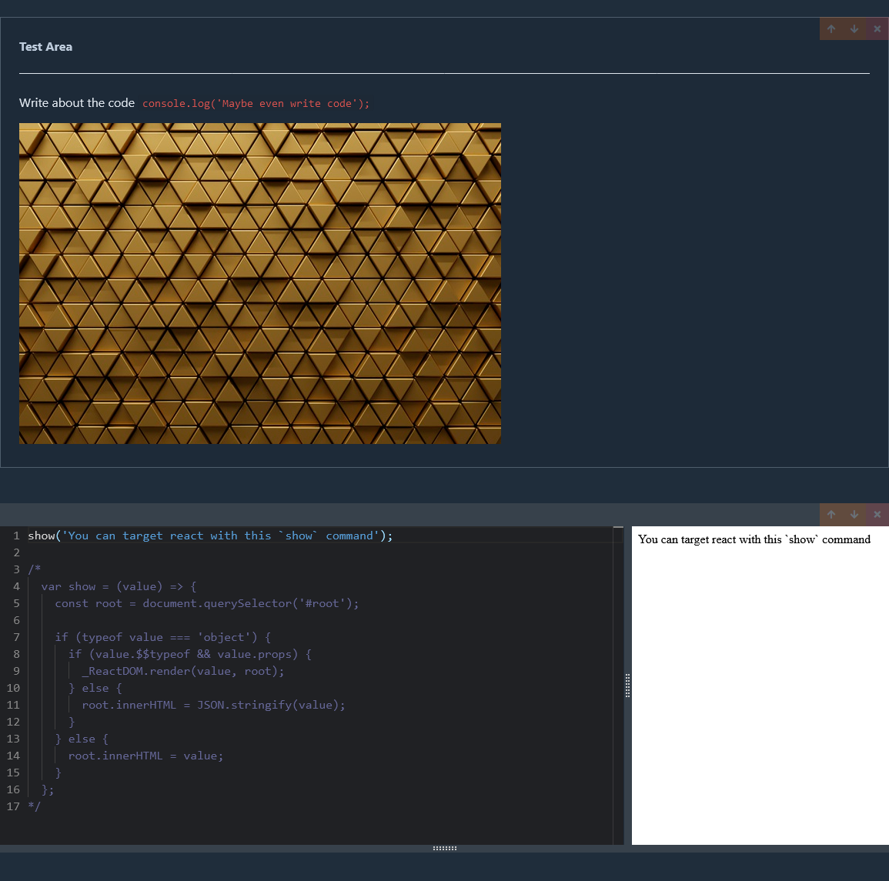
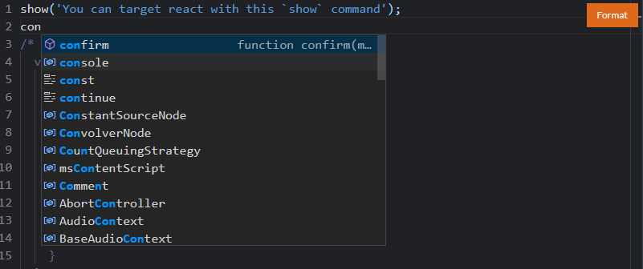
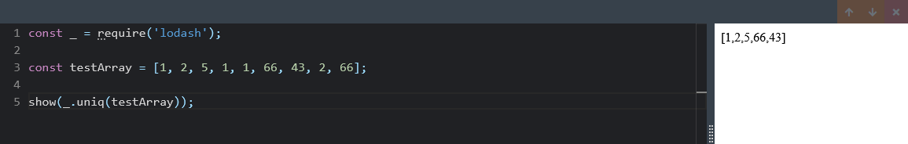
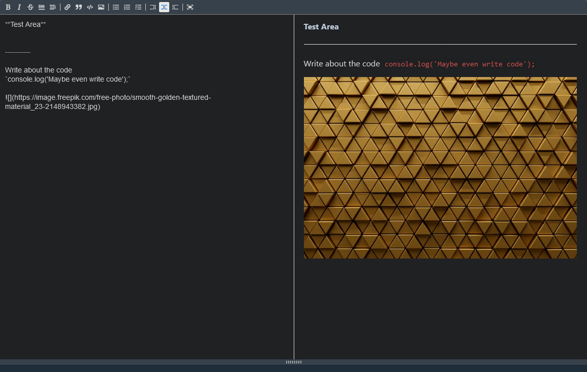
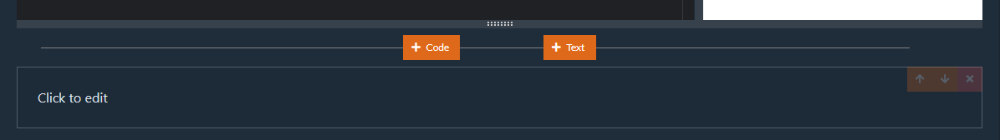

# React Documentation App
Create and share readme and code snippets for React, supports importing libraries from npm, accessing `#root` with React via `show()`, auto formatting the code (prettier), text editor support, arranging the cells, etc.

# Like VSCode on the web
It literally uses the same engine as VSCode, so you can see autocomplete and coloration like you would expect from a full IDE. When you click in the cell, you can see a `format` option float on the right side to apply Prettier to your code and clean things up.

# Import libraries
You can import your favorite libraries and access them easily, they will be cached where applicable but be mindful that large downloads can be slow at first. 

Code is shared across cells, so you can import in one and call in another. Also, `React` was handled in such a way that you can import another and not cause issues. 

# Text Editor Support
The text editor supports expected things like styling and code snippets, when you click on a cell it will go from displaying text, to editing it.

# Displaying Cells
You can grow and shrink the cells as needed, plus you can add and rearrange as many as you'd like. 

